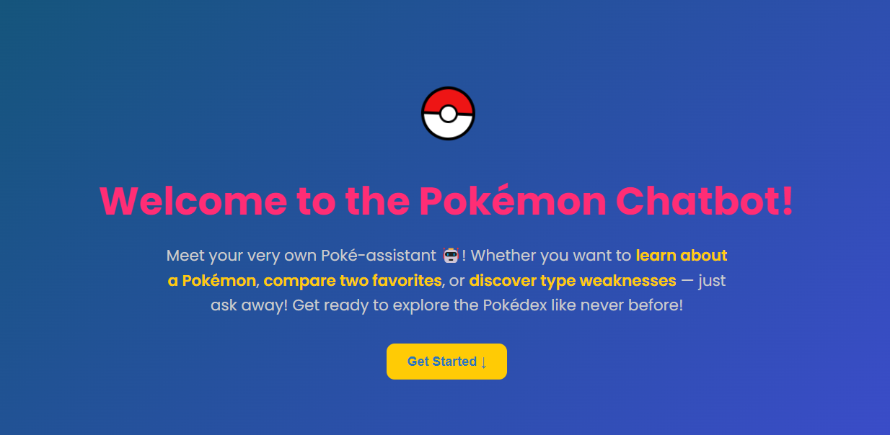
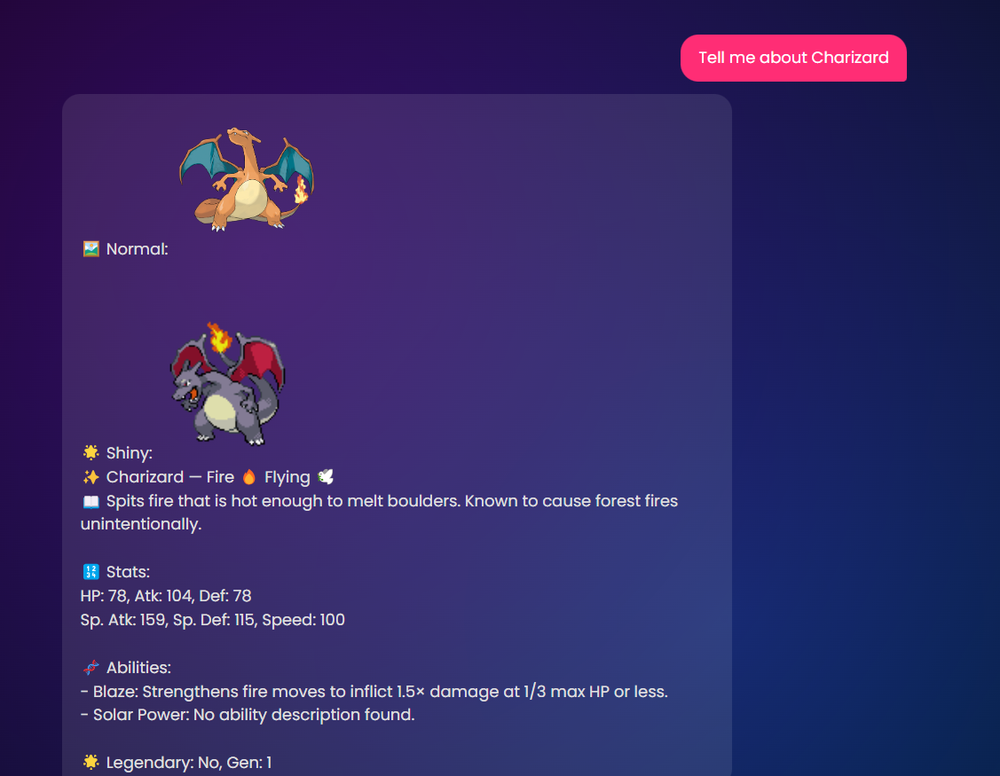

<h1 align="center">
  🧠 PokéBot - Your Smart Pokémon Chatbot 💬
</h1>

<p align="center">
  
  
  
  
</p>

---

### ⚡ Features

> Ask questions, compare stats, or discover surprises — this chatbot knows over 800 Pokémon upto Sun and Moon!

🧠 Natural language support using spaCy  
⚡ Fuzzy matching with RapidFuzz (e.g., "peekachu" still finds Pikachu)  
🎨 Renders official & shiny Pokémon artwork  
📊 Stat comparison between two Pokémon  
🛡️ Weaknesses, resistances & immunities  
🧪 Includes abilities, descriptions & generation info  
🌐 CORS enabled, works with any frontend

---

2️⃣ Frontend Open index.html in your browser. Edit chat.js if you change ports.

🧠 How It Works spaCy: Extracts entities and Pokémon names from user queries

RapidFuzz: Fuzzy matches typos or similar names

Flask: Hosts the chatbot logic via a single /ask endpoint

Frontend: Simple JS captures input, renders messages

🎮 Example Queries vbnet Copy Edit → Tell me about Bulbasaur
→ Compare Charizard and Blastoise
→ What is Gengar weak to?
→ Show me a random Pokémon
→ Info on Lucario

📸 Screenshots 

Introduction Page:

Prompt:


✨ Credits PokeAPI Sprites spaCy NLP RapidFuzz Pokémon type emojis

📬 Crafted with ❤️ by Team PokéBot

— @OmkarChoughule · @M-Durga-Prasath · @Mano-Bharathii

---

### 🚀 Getting Started

#### 1️⃣ Backend Setup

```bash
git clone https://github.com/yourusername/pokemon-chatbot
cd pokemon-chatbot
pip install -r requirements.txt
python -m spacy download en_core_web_sm
python app.py
